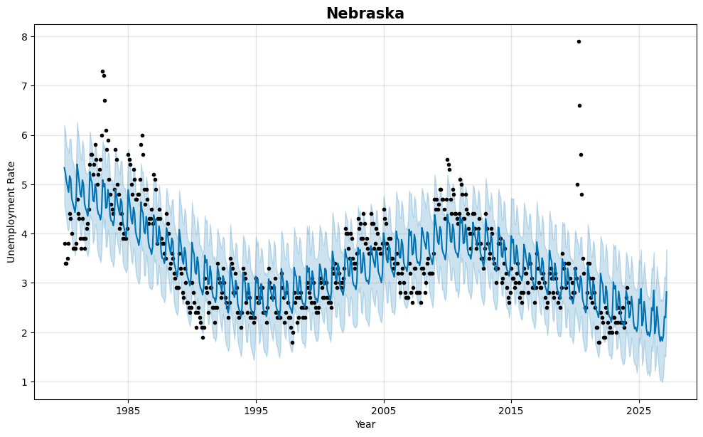

# Unemployment Rate Predictor

<center>
  
<center>

## Overview

Unemployment Rate Predictor is a Python application designed to analyze the impact of various data vs unemployment rates. The project aims to answer the question: "The Federal Reserve is poised to decrease the Fed Funds Rate (commonly called the interest rates), as the PCE inflation rate continues to get closer to its target range of 2 percent. What will this mean for unemployment at the state-level?"

## Table of Contents

1. [Installation](#installation)
2. [Usage](#usage)
3. [Analysis](#analysis)
4. [Contributers](#contributers)
5. [Conculusion](#conclusion)

## Installation

## Installation

To install the necessary dependencies for this project, use the following commands:

```bash
pip install pandas
```
```bash
pip install numpy
```
```bash
pip install requests
```
```bash
pip install json
```
```bash
pip install dotenv
```
```bash
pip install os-sys
```
```bash
pip install prophet
```
```bash
pip install plotly-express
```
```bash
pip install kaleido
```


## Usage

To use this application, follow these steps:

1. **Clone the Repository**
    - Navigate to the "Code" drop-down menu on the repository page.
    - Copy the SSH URL.

2. **Set Up Your Project Directory**
    - Open your terminal.
    - Create a new directory for the project:
      ```bash
      mkdir unemployment-rate-predictor
      ```
    - Change to the new directory:
      ```bash
      cd funemployment-rate-predictor
      ```

3. **Clone the Repository**
    - Clone the repository using the copied SSH URL:
      ```bash
      git clone <git@github.com:emcmanus12/team-4-project-1.git>
      ```

4. **St.Louis Fed API Key**
    - Create an API key to access the FRED database, as this will be required to download the dataset being used for the analysis. The instructions can found on: [FRED](https://fred.stlouisfed.org/docs/api/fred/)
    - Create a .env file and save the API key under FRED_API_KEY


5. **Run the Jupyter Notebook**
    - Launch Jupyter Notebook:
      ```bash
      jupyter notebook
      ```
    - Open the relevant notebook file and run through the cells to get your outputs.


## Analysis

### Question

"The Federal Reserve is poised to decrease the Fed Funds Rate (commonly called the interest rates), as the PCE inflation rate continues to get closer to its target range of 2 percent. What will this mean for unemployment at the state-level?"


### Approach

- **Correlations between Unemployment & PCE Inflation Rate**: Analyze the correlation between unemployment and PCE inflation.
- **Correlation between Unemployment & Fed Funds Rate**: Examine the correlation between unemployment and Fed Funds rates.
- **Forecasting Unemployment with Prophet**: Use Prophet to forecast unemployment based on assumptions of lower interest rates and inflation.
- **Further Analysis**: Evaluate the results and decide if there are any other analysis required

# Conclusion 

1. **Unemployment and Inflation**: Examining the relationship between unemployment and inflation rates reveals an intriguing connection. Historically, when inflation rates experience a decline, there's often a corresponding decrease in unemployment levels. This correlation becomes even more pronounced when analyzing data from the past two years, suggesting a nuanced interplay between economic factors.


3. **Unemployment and Fed Funds Rate**: Exploring the dynamics between unemployment and the Federal Reserve's interest rate, known as the Fed Funds Rate, uncovers intriguing insights. Notably, when the Federal Reserve opts to lower interest rates, there tends to be a subsequent decrease in unemployment rates. This pattern becomes particularly evident when considering historical unemployment trends and their correlation with past adjustments to the Fed Funds Rate.


3. **Prophet Forecast Model**: Leveraging advanced forecasting techniques such as the Prophet model offers valuable insights into future unemployment trends. By employing sophisticated algorithms, the Prophet model predicts a forthcoming decline in unemployment rates across all states. This forward-looking analysis provides valuable foresight into potential economic shifts and informs strategic decision-making processes.



4. **Pandemic Analysis (Futher analysis)**: Conducting a thorough analysis of the pandemic's impact on unemployment rates reveals noteworthy findings, particularly in states heavily affected by the crisis. For instance, Nevada (NV) emerged as one of the states hardest hit by the pandemic, grappling with persistently high unemployment rates. Despite efforts to mitigate the economic fallout, Nevada continues to face significant challenges on its path to recovery, underscoring the enduring repercussions of the pandemic on local economies.


## Recommendations
- #TODO (something on the lines: The analysis is a good first step to evaluating the unemployment trend, but there are other factors that can affect unemploymnet which need to be investigated to understand anomolies like California)

## References

- **St. Louis Federal Reserve (FRED)**: All the datasets used in the analysis
- #TODO for videos
   
## Contributers

Ian Cody,
Jaidev Kler,
Ethan McManus,
Kyle Prudente,
Grigoriy Isayev,
Emmanuel Charles.
