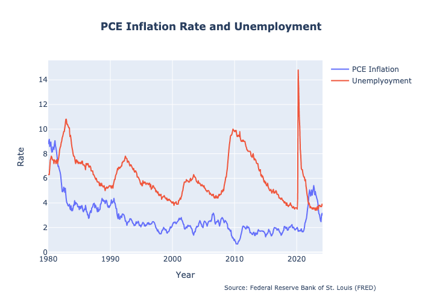
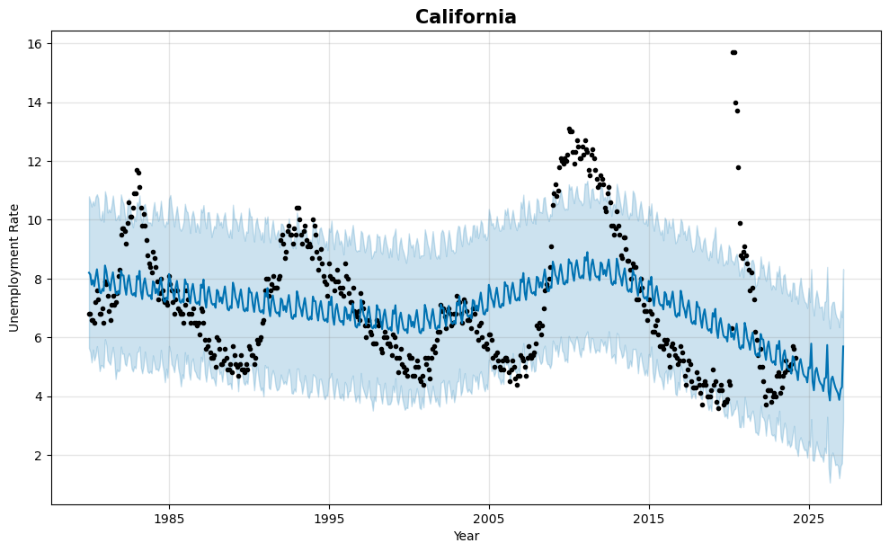

# Unemployment Rate Predictor


## Overview

Unemployment Rate Predictor is a Python application designed to analyze the impact of various data vs unemployment rates. The project aims to answer the question: "How do interest rates, the Federal Funds Rate, and the effects of the pandemic compare to unemployment rates, and will unemployment decrease or rise when considered alongside inflation?"

## Table of Contents

1. [Installation](#installation)
2. [Usage](#usage)
3. [Analysis](#analysis)
4. [Contributers](#contributers)
5. [Conculusion](#conclusion)

## Installation

Provide instructions on how to install your Python application. Include any dependencies that need to be installed and how to install them (e.g., using pip).

```bash
!pip install plotly-express
```

## Usage

To use this application, follow these steps:

1. **Clone the Repository**
    - Navigate to the "Code" drop-down menu on the repository page.
    - Copy the SSH URL.

2. **Set Up Your Project Directory**
    - Open your terminal.
    - Create a new directory for the project:
      ```bash
      mkdir fedrateimpactpredictor
      ```
    - Change to the new directory:
      ```bash
      cd fedrateimpactpredictor
      ```

3. **Clone the Repository**
    - Clone the repository using the copied SSH URL:
      ```bash
      git clone <git@github.com:emcmanus12/team-4-project-1.git>
      ```

4. **Run the Jupyter Notebook**
    - Launch Jupyter Notebook:
      ```bash
      jupyter notebook
      ```
    - Open the relevant notebook file and run through the cells to get your outputs.

## Analysis

### Question

"How do interest rates, the Federal Funds Rate, and the effects of the pandemic compare to unemployment rates, and will unemployment decrease or rise when considered alongside inflation?"

### Approach

- **Correlations between Unemployment & Inflation**: Analyze the correlation between unemployment and inflation.
- **Correlation between Unemployment & Interest Rates**: Examine the correlation between unemployment and interest rates.
- **Forecasting Unemployment with Prophet**: Use Prophet to forecast unemployment based on assumptions of lower interest rates and inflation.

# Conclusion 

1. **Unemployment and Inflation**: Examining the relationship between unemployment and inflation rates reveals an intriguing connection. Historically, when inflation rates experience a decline, there's often a corresponding decrease in unemployment levels. This correlation becomes even more pronounced when analyzing data from the past two years, suggesting a nuanced interplay between economic factors.



3. **Unemployment and Fed Funds Rate**: Exploring the dynamics between unemployment and the Federal Reserve's interest rate, known as the Fed Funds Rate, uncovers intriguing insights. Notably, when the Federal Reserve opts to lower interest rates, there tends to be a subsequent decrease in unemployment rates. This pattern becomes particularly evident when considering historical unemployment trends and their correlation with past adjustments to the Fed Funds Rate.


3. **Prophet Forecast Model**: Leveraging advanced forecasting techniques such as the Prophet model offers valuable insights into future unemployment trends. By employing sophisticated algorithms, the Prophet model predicts a forthcoming decline in unemployment rates across all states. This forward-looking analysis provides valuable foresight into potential economic shifts and informs strategic decision-making processes.



4. **Pandemic Analysis**: Conducting a thorough analysis of the pandemic's impact on unemployment rates reveals noteworthy findings, particularly in states heavily affected by the crisis. For instance, Nevada (NV) emerged as one of the states hardest hit by the pandemic, grappling with persistently high unemployment rates. Despite efforts to mitigate the economic fallout, Nevada continues to face significant challenges on its path to recovery, underscoring the enduring repercussions of the pandemic on local economies.


   
## Contributers

Ian Cody,
Jaidev Kler,
Ethan McManus,
Kyle Prudente,
Grigoriy Isayev,
Emmanuel Charles.
